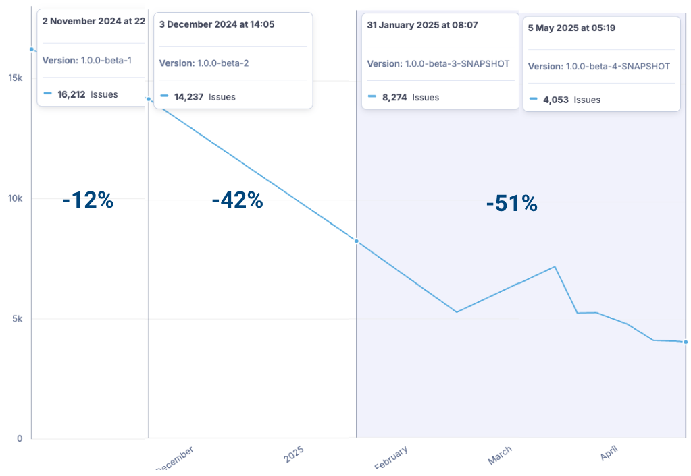

# What is Operaton?

- The free Open Source BPM Engine for everyone
- Fork of Camunda 7 CE
- State-of-the-art with its own vision for the future

---

# Our vision

Operaton shall be a sustainable BPM solution at least for the **next decade**.

- Completely **Free Open Source** (not only open core)
- Community ownership via a **legal foundation**
- No vendor lock-in, no licence fees, no restrictions
- All components will be Open Source
- **Seamless migration** from Camunda 7 CE to Operaton
- Completely **renew the code base** including the webapps
- Provide an environment that is **welcoming for contributors**
- Enable **professional services** by **third parties**

---

# Compatibility to Camunda 7 CE

- REST API 100% the same
- Database schema 100% the same
- Camunda 7 BPMN models can be used without changes
- No public API removed
- Deprecated APIs documented, but not removed yet
- 0 API breakages

---

# Who are we?

## Core Contributors
- Karsten Thoms (itemis AG)
  - Main contributor
- Julian Haupt (backoffice.plus)
  - Social Media manager
  - Backports
- Paul Hempel (lambdaschmiede GmbH)
  - New web applications
  - operaton.org Website

... and 20 more contributors

---

# Who are we?
## Initiators

- Tim Zöller (lambdaschmiede GmbH)
  - Former Camunda trainer
- Andreas Zill (n3rdy by natur3 UG (haftungsbeschränkt))
  - Documentation
  - Legal
- Andreas Klein (DemandFlow GmbH)
  - Documentation
  - Legal

---

# History

## October 2024
- Creation of the fork
- Release of the first Camunda 7 fork on the market
- Re-Branding of Camunda 7 CE as Operaton
- Release 1.0.0-beta-1

---
# History

## December 2024
- Release 1.0.0-beta-2
- Raise minimal Java version to 17
- Set up build infrastructure
- First automated release with JReleaser
- Enable static code and coverage analysis with SonarQube

---
# History

## January 2025
- Release 1.0.0-beta-3
- First release of "Operaton" distribution (formerly known as "Camunda Run")
- Enablement of integration tests for all distributions
- First release with Docker and Helm Charts
- Massive reduction of Sonar findings

---
# History

## May 2025
- Release 1.0.0-beta-4
- First release with full JakartaEE 10 migration
- Drop JavaEE support
- Enable integration tests for all distributions and with database using Testcontainers

---

# Why is Operaton still beta while other forks have already final releases?

---

# Roadmap

## Q2/2025
- Publish revised documentation
- Founding of the Operaton e.V. non-profit organization
- Release of new web apps beta (replacement for tasklist, cockpit and admin)

## Q3/2025
- Release of new web apps beta (replacement for tasklist, cockpit and admin)
- Prepare semi-automatic migration path to Operaton

---

# Roadmap

## October 2025
- End of life Camunda 7.24 CE
- Backport remaining features from Camunda 7.24 CE to Operaton
- Release 1.0 based on 7.24 CE
- Publish distributions via various packagers like Homebrew, Winget

---

# Roadmap - 2026 and beyond

- Release version 1.1 – No breaking changes
- Further improvements based on our users needs
- Remove deprecated code

---

# Early Adopters

- Ritense
- OpenBPM
- Bundesministerium für Arbeit und Soziales
- Sucurema

(others that don't want to get publicly named (yet 😉))

---

# Code Base Renewal

- Raise Java to language level 17
- Drop support for legacy JavaEE containers
- Raise dependencies to latest and secure versions
- Migrate tests to JUnit 5 & AssertJ
- Resolve security & static code analysis findings

---

# Activity

- 750 commits
- ~20 contributors
- Changed files: 18.903 (8.454 unique)
- Changed lines:
  - +152.513
  - -180.351
  - => - 27.838
- 3.800 CI workflow executions

---

# Drop Legacy JavaEE

- Camunda 7 code base is bound to JavaEE API (javax namespace)
- JakartaEE API provided by build-time transformations
- JavaEE dependency implied multiple dependencies on outdated libraries
- Support of legacy containers (Tomcat 9, Wildfly 26) and build time transformations made the build complex

---

# Code Cleanup

- Initial code base had 16k Sonar issues
- 12k issues resolved
- ~50% resolved with help of OpenRewrite
  

---

# JUnit 5 migration

- 25k automated test cases in JUnit 4
- Created a new extension library for JUnit 5
- 48 / 57 modules fully migrated
- Largest module `engine` in progress

---

# Final Words

- We strongly believe that Operaton is the best BPM engine for the next decade
- Shout out to Camunda for providing a great code base 🙏
- Thanks to all contributors and supporters

---

# Where to contribute?

- GitHub: https://github.com/operaton/operaton/
- https://operaton.org
- Join the forum https://forum.operaton.org/
- Join the Slack
