# Agenda

- Meet & Greet (10 min) - Done
- Facts & Numbers (5 min)
- Operaton 1.0.0-beta-4
  - Lookback: Release Meetup in Amsterdam (10 min)
  - Achievements (10 min)
- Update: Operaton e.V. (5 min)
- Update: Documentation (5 min)
- Update: New Web Apps (5 min)
- Ecosystem: OpenBPM (10 min)
- Market situation other forks (10 min)
- Outlook: 1.0.0-beta-5 (10 min)
- Discussion & Closing (10 min)

---

# Facts & Numbers

New contributors (since last Townhall 2025-03-14)

- Antoine Campbell
- José Guilherme
- Andreas Goß
- Brijesh Thummar
- Max Starikov
- Tobias Unger

Linked In Followers: 283

---

# Facts & Numbers

| Overall Repository Statistics     | 2025-03-14   - 2025-05-27 |
|-----------------------------------|-------------------------------|
| Number of commits:                | 251                           |
| Total files changed (sum):        | 4534                          |
| Unique files changed:             | 2371                          |
| Lines added:                      | 42536                         |
| Lines removed:                    | 45092                         |
| Net lines difference (+add/-del): | -2556                         |
| Avg. files changed per commit:    | 18.06                         |
| CI Workflow executions            | 3.800                         | 

---

# Facts & Numbers: Early Adopters

- Ritense
- OpenBPM
- Bundesministerium für Arbeit und Soziales
- Sucurema

(others that don't want to get publicly named (yet 😉))

---

# Operaton 1.0.0-beta-4: Release Party Amsterdam

- On May 14th an On-Site event in Amsterdam took place
- Karsten & Andreas K. from Operaton team
- 11 attendees from Netherlands and Czech Republic
- 2 presentations: Operaton vision & state (Andreas/Karsten), Valtimo migration (Rutger,Martin/Ritense)

---

# Operaton 1.0.0-beta-4: Achievements

- JavaEE legacy (almost) completely dropped

  - Removed Wildfly 26 & Tomcat 9 sources
  - Replaced JavaEE API by JakartaEE 10 API
  - Enabled Testcontainers for Arquillian based integration tests

---

# Operaton 1.0.0-beta-4: JUnit 5 migration

- 25k automated test cases in JUnit 4
- Created a new extension library for JUnit 5
- 48 / 57 modules fully migrated
- Largest module `engine` in progress

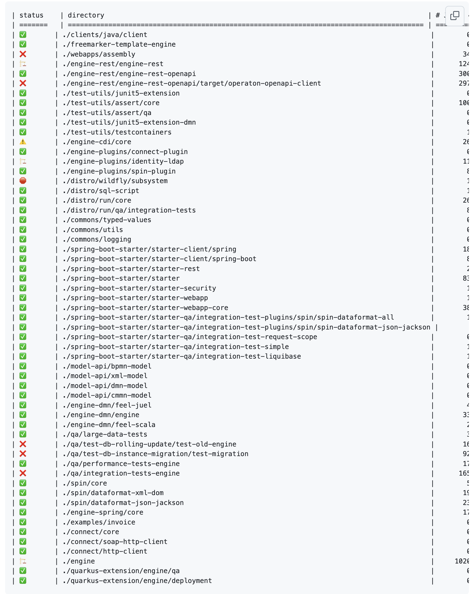

---

# Update: Operaton e.V.

---

# Update: Documentation

- https://github.com/operaton/documentation
- Documentation revised for Operaton complete
- Docusaurus used as framework
- Launched today 🎉

---

# Update: Documentation

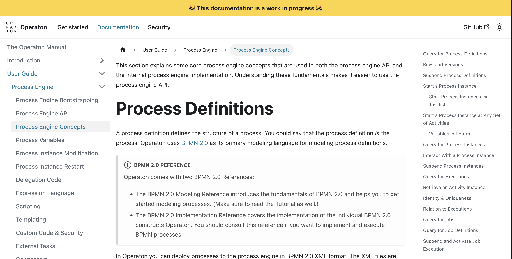

---

# Update: Documentation

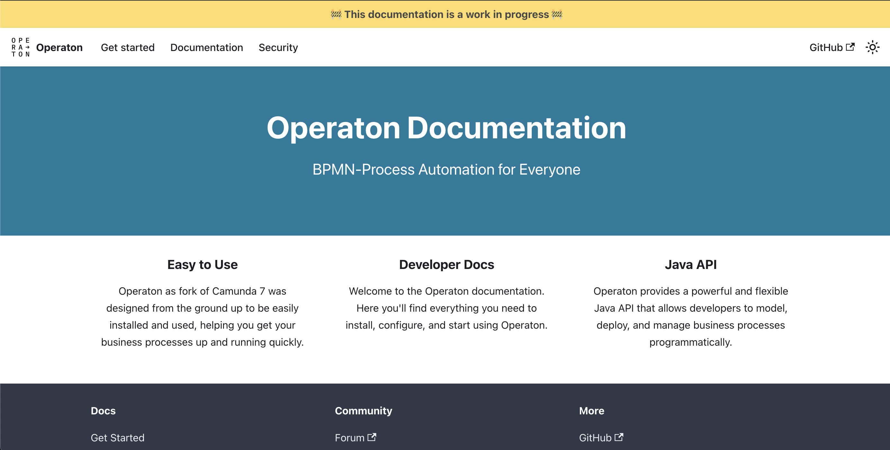

---

# Update: New Web Apps

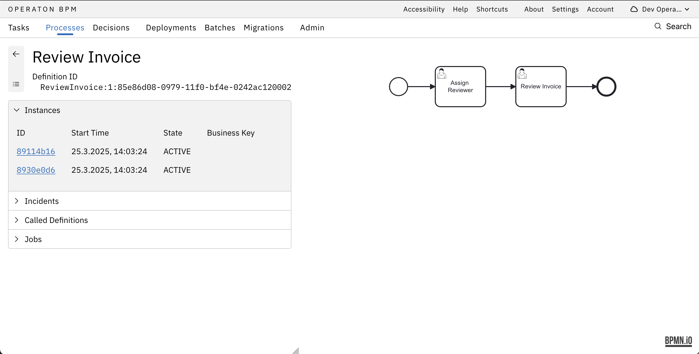

---

# Update: New Web Apps

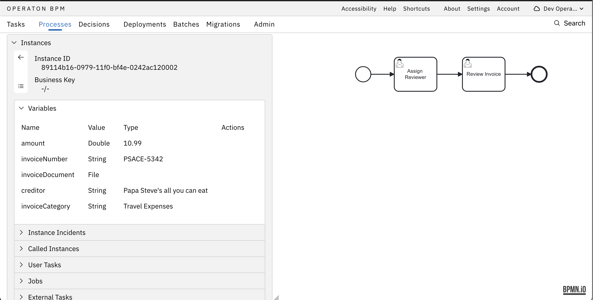

---

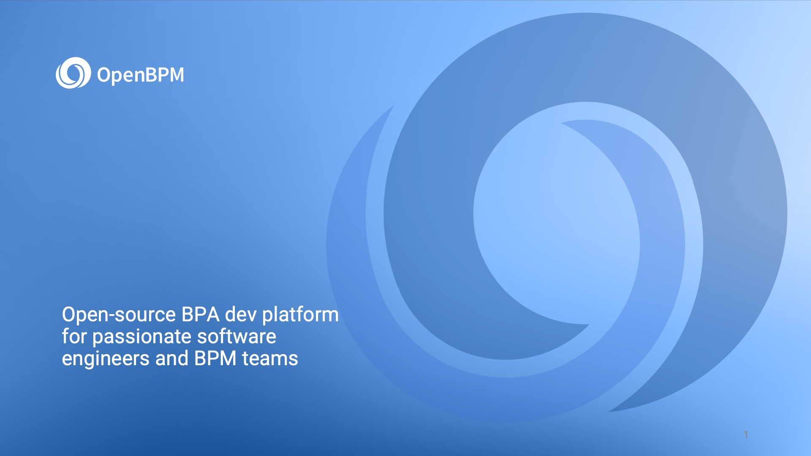

---

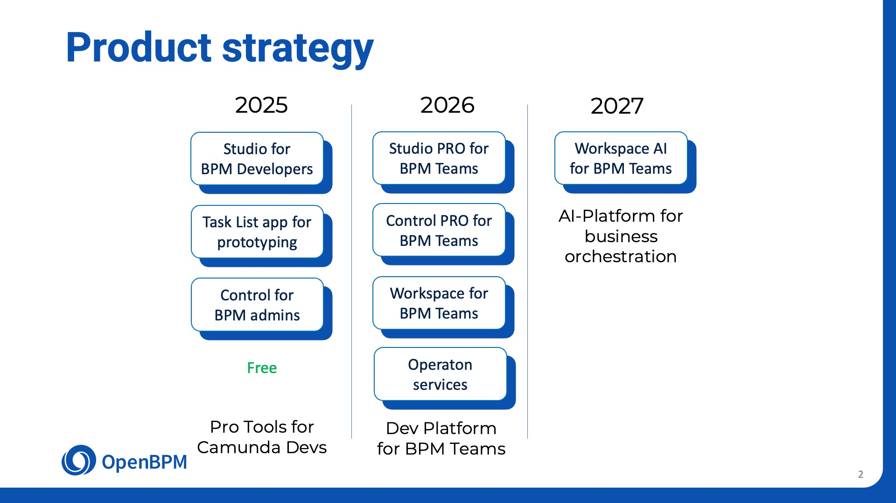

---

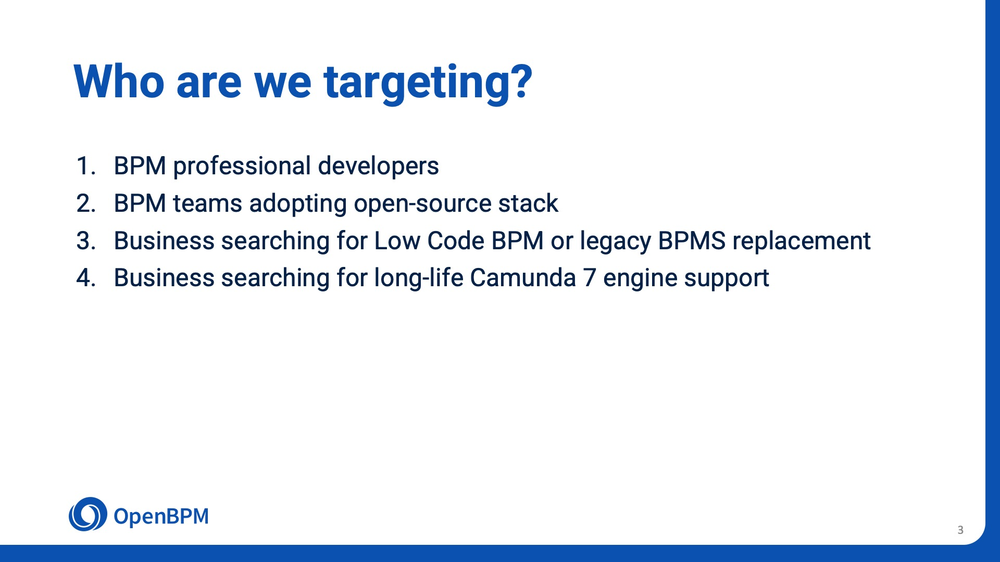

---

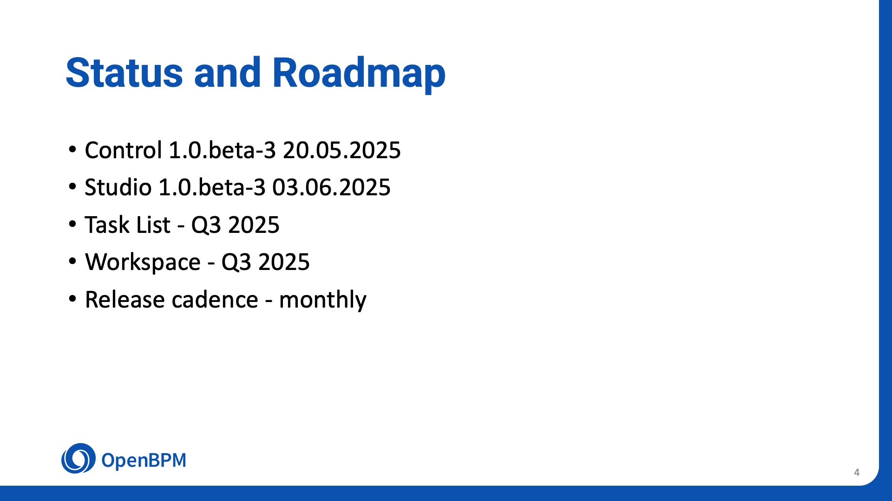

---

# Market situation other forks

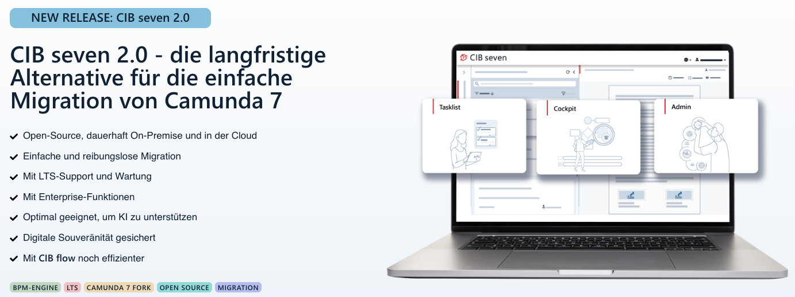
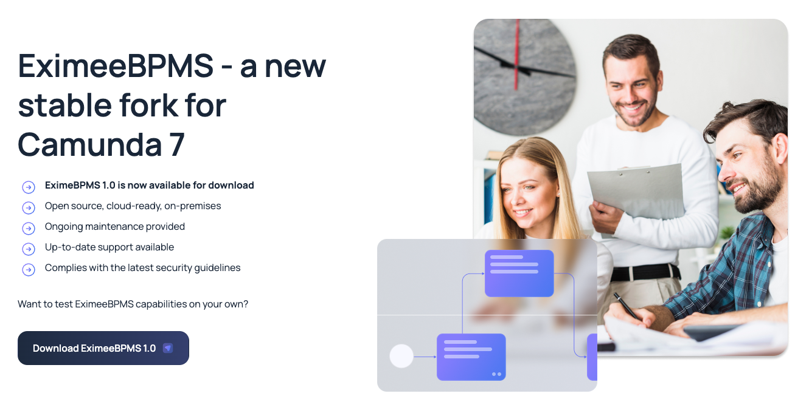 

---

# Outlook: 1.0.0-beta-5

- Enablement of other databases in integration tests
- Enable rolling database update tests
- Upgrades
  - Wildfly 36
  - SpringBoot 3.5
- Deprecations
- JUnit 5 migration
  - &gt; 70% of engine tests
  - 2 - 3 other modules

---

# Public Relations

- June 11th: JUG Darmstadt (Tim)
- Nov 2nd: W-JAX Munich (Tim)

 

