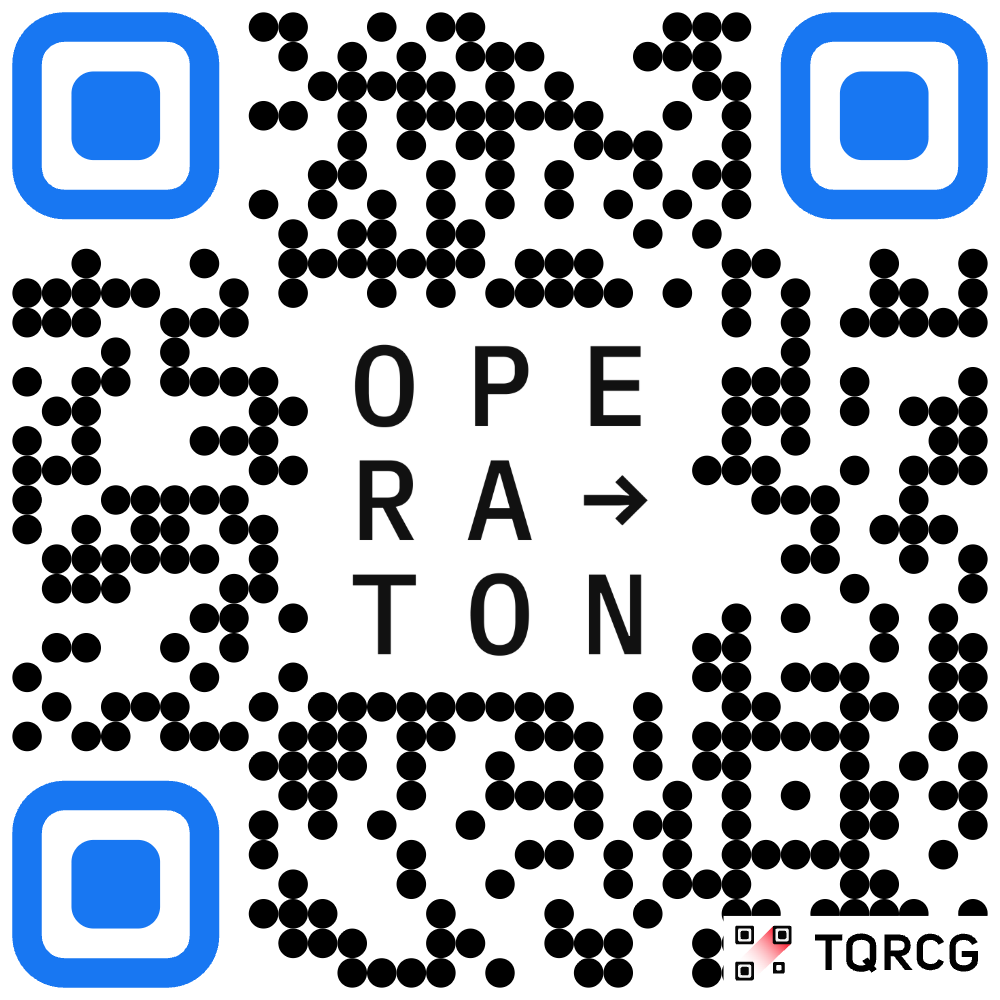

# What is Operaton?

- A Java based free Open Source BPM Engine
- Fork of Camunda 7 CE
- State-of-the-art with its own vision for the future
- Forked in October 2024
- Final release 1.0 this week!

---

# What can be done?

- Final testing of the 1.0 release
- Documentation improvements
- "Good First Issues" (Java, GitHub CI)
- Scripts to gather monthly project statistics 
- ⭐️ Star us on GitHub, follow our LinkedIn!
- No valid change is too trivial 😉
- ⚠️ Help us reduce Sonar, IDE, build warnings

---

# Where to contribute?

- GitHub: https://github.com/operaton/operaton/
- https://operaton.org
- Join the forum https://forum.operaton.org/
- Join the Slack
