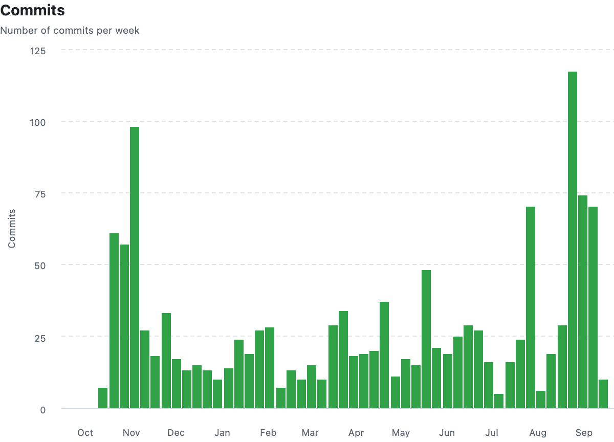
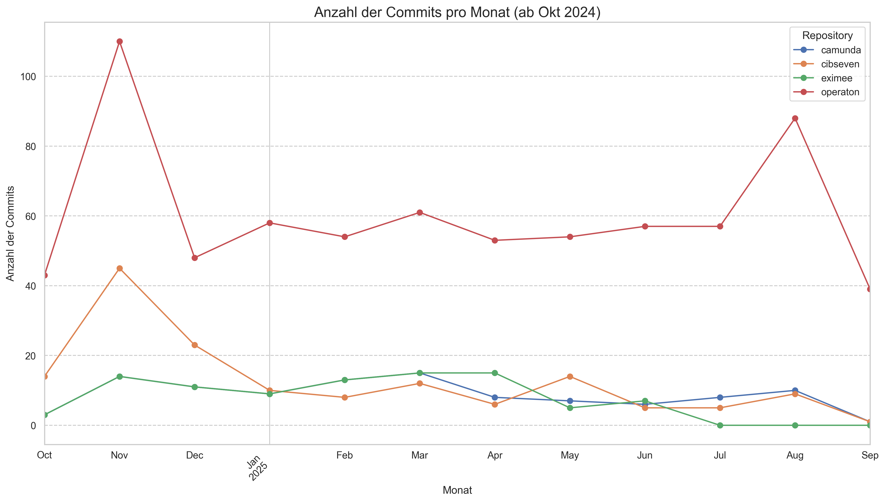

# Mission Statement

Operaton shall be a sustainable BPM solution at least for the **next decade**.

- Completely **Free Open Source** (not only open core)
  - Community ownership via a **legal foundation**
  - No vendor lock-in, no licence fees, no restrictions
  - All components will be Open Source
  - **Seamless migration** from Camunda 7 CE to Operaton
  - Completely **renew the code base** including the webapps
  - Provide an environment that is **welcoming for contributors**
  - Enable **professional services** by **third parties**

---

# Compatibility to Camunda 7 CE

- Compatible to Camunda CE 7.23 (in progress: 7.24)
  - REST API 100% the same
  - Database schema 100% the same
  - Camunda 7 BPMN models can be used without changes

---

# Who are we?

## Core Contributors
- backoffice.plus
  - itemis AG
  - lambdaschmiede GmbH
  - OPITZ CONSULTING Deutschland GmbH
  - Otus GmbH
  - uubato

## Community Contributors

- 50+ contributors

---

# Operaton e.V.

- Non-profit association registered in Germany
  - Founding in progress
  - Owner of the Operaton trademark
  - Core responsibilities:
    - Ensuring long-term sustainability
    - Governance of the project
    - Legal entity for vendor-independent donations, sponsorships
    - Organizing community events
    - Ensuring that Operaton remains Free Open Source Software

---

# Roadmap

- Q3/2024: Fork initiation, first beta release
  - Q3/2024 - Oct 2025
    - Code base renewal
    - Drop legacy
    - Testing, testing, testing & test automation
    - Backporting features from Camunda CE
  - Oct 14th 2025: Camunda 7.24 CE released, End-of-Life
  - Nov 2025: Operaton 1.0 release

---

# Roadmap 2026 and beyond

- Establish plannable release cycles
  - Q1/2026: Operaton 1.1: Further non-breaking improvements, bug fixes, dependency updates
  - 2026: 
    - New web applications (replacement for tasklist, cockpit and admin)
    - SpringBoot 4 support (SpringBoot 3 goes end of support)
  - In discussion: 2.0 vs. 1.x

---

# Why is Operaton still beta while other forks have already final releases?

---

# Early Adopters

- Ritense
  - Haulmont / OpenBPM
  - Bundesministerium für Arbeit und Soziales
  - Sucurema
  - AOK Niedersachsen
  - "Big 4" Netherlands (Amsterdam, Rotterdam, The Hague, Utrecht)
  - 50+ municipalities in Netherlands

(others that don't want to get publicly named (yet 😉))

---

# Activity

- &gt; 1.000 more commits than Camunda 7 and other forks
  - Frequent contributions every week
  - Semi-Automatic dependency updates

---

# Activity

---

# Activity

---

# Why is Operaton the best BPM engine for the next decade?

- Free Open Source (not only open core)
  - No vendor lock-in
  - Flexible usage without restrictions
  - Up-to-date technology stack
  - Driven by a strong community with passion
  - Growing ecosystem of applications, tools and service providers

---

# Why prefer Operaton over Camunda 8?

- No vendor lock-in
  - Camunda 8 is _very_ expensive
  - Not embeddable
  - Not transactional
  - Not feature complete

---

# How to ensure long-term sustainability?

- Support contract with Service Provider
  - Sponsor development of required features
  - Contribute yourself
  - The project needs paid FTEs

---

# Final Words

- We strongly believe that Operaton is the best BPM engine for the next decade
- Shout out to Camunda for providing a great code base 🙏
- Thanks to all contributors and supporters

---

# Where to contribute?

- GitHub: https://github.com/operaton/operaton/
- https://operaton.org
- Join the forum https://forum.operaton.org/
- Join the Slack
